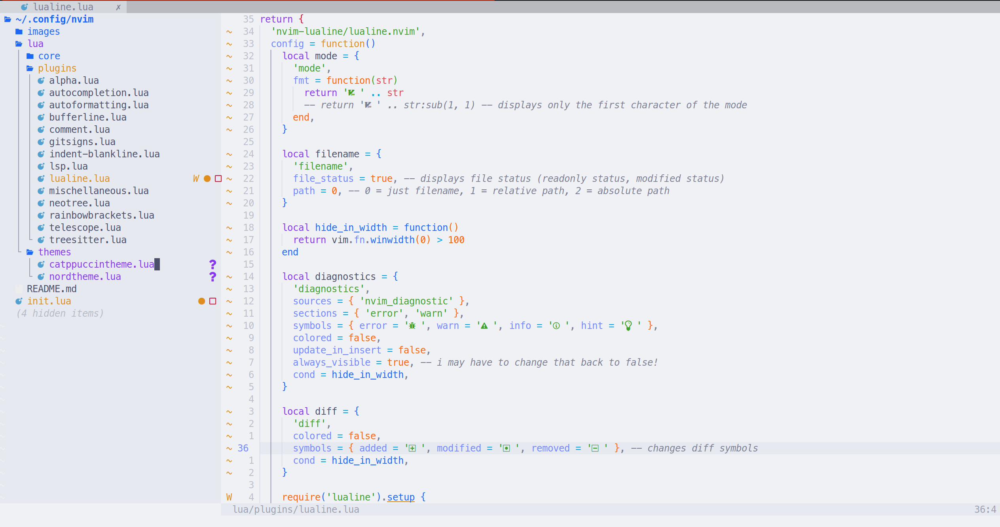
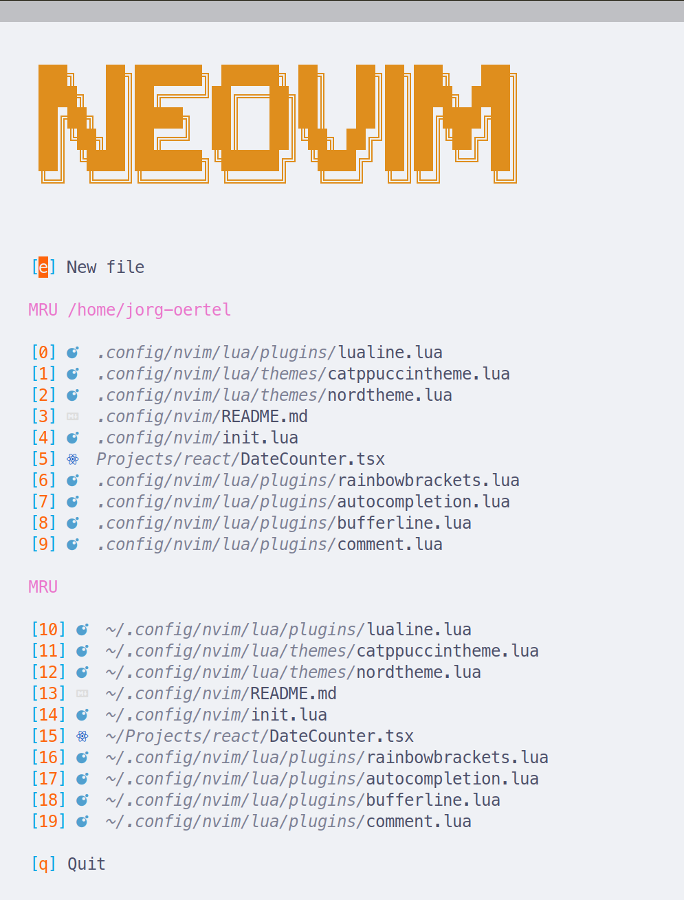

# Screenshots

Place your screenshots inside an `images/` folder next to your `README.md`, for example:

```
~/.config/nvim/
  README.md
  docs/
  images/
    cattpuccin_theme_dark.png
    cattpuccin_theme_light.png
```

Then reference them here:

```markdown


```

You can also embed additional screenshots of:

- LSP in action
- Telescope finders
- Neo-tree layout
- Git integrations
